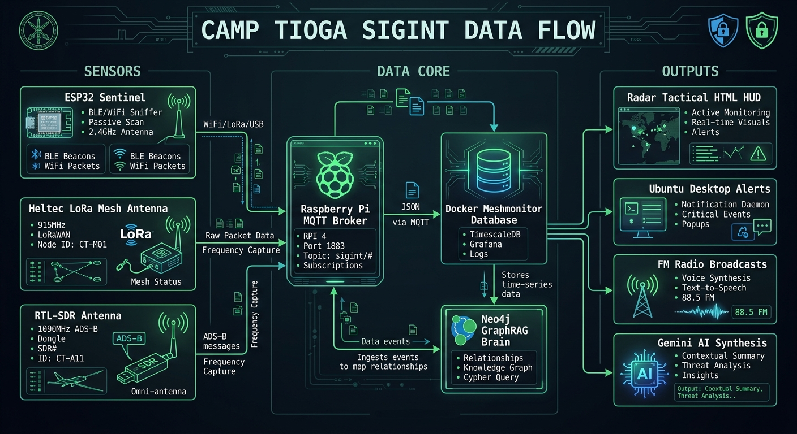

# Charles Forsyth - Tactical Data Architecture & Systems Engineering

This repository hosts my professional portfolio and technical documentation.

## Featured Architecture: Camp Tioga SIGINT Data Flow
Below is a high-level representation of a privately developed, multi-spectrum intelligence gathering and synthesis platform I built. It integrates Edge Computing (ESP32), Radio Frequency Intelligence (LoRa, ADS-B, BLE), Containerized Data Lakes (TimescaleDB/Neo4j), and Generative AI (Gemini GraphRAG).

### **The Architecture (4-Layer Tactical Stack):**
1. **Sensors (Collection):** Custom ESP32 C++ payloads sniffing 2.4GHz BLE/WiFi, Heltec V4 nodes mapping 915MHz LoRa mesh traffic, and RTL-SDR antennas tracking 1090MHz ADS-B transponders.
2. **Data Core (Ingestion):** A Raspberry Pi 4 operating as the central MQTT Broker, routing JSON payloads into Dockerized SQL databases.
3. **Intelligence Engine (Synthesis):** A Neo4j Graph Database (The "Brain") that ingests the raw time-series data and uses Google Gemini 2.5 embeddings to map relationships between physical assets, IP addresses, MAC vendors, and geographic coordinates.
4. **Command & Control (Output):** Autonomous python watchdogs that trigger native Ubuntu desktop notifications, synthesize text-to-speech FM radio broadcasts, and generate a dynamic HTML/Jinja2 Tactical HUD for real-time situational awareness.
